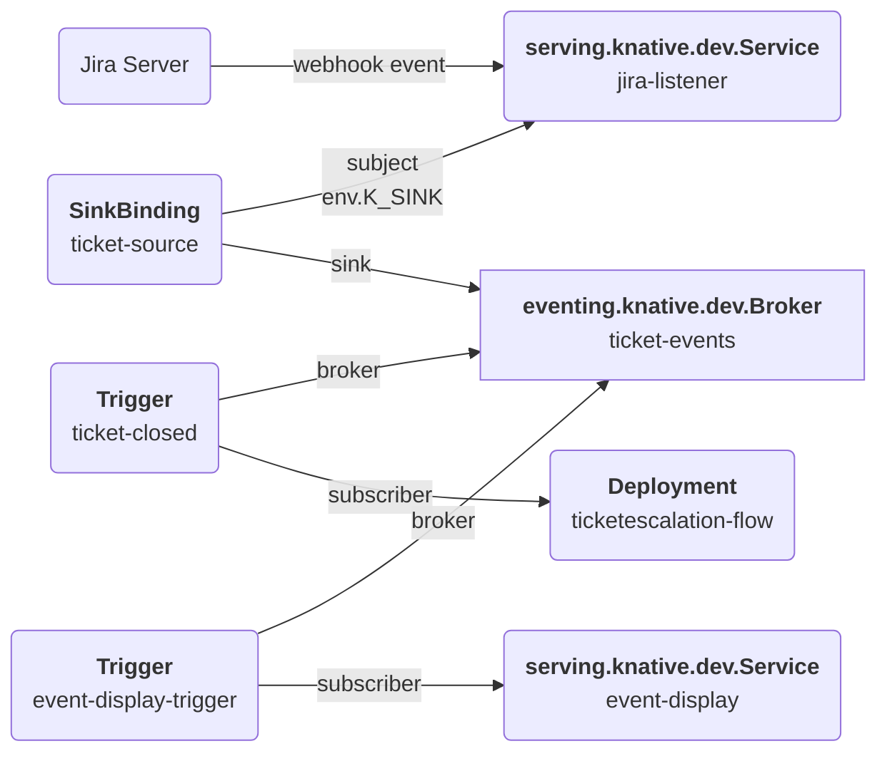
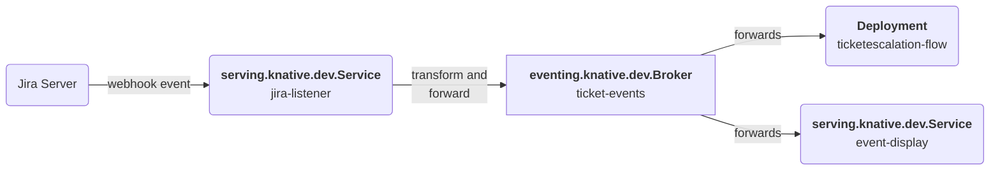

# System Architecture
As described by the following architectural diagram, the system is made of the following services:
1. `ticketescalation` the escalation workflow application, modelled as a SonataFlow instance (and related deployments and resources managed by the operator)
2. `jira-listener` a Quarkus service deployed as a serverless Knative Service to monitor webhook events from the configured Jira Server and transform them into [Cloud Events](https://cloudevents.io/) to trigger the `ticketescalation` workflow
3. `event-display` another serverless Service whose purpose is to connect to the event broker and print the Cloud Events sent to the broker
4. `newsletter-postgres` is a regular OpensShift Deployment which implements the subscription data store with a PosgreSQL database

## System architecture: application layer
``mermaid
graph LR
    ticketescalation-sf(<b>SonataFlow</b><br/>ticketescalation-flow)
    ticketescalation(<b>Deployment</b><br/>ticketescalation-flow)
    01-ticketescalation-resources(<b>ConfigMap</b><br/>01-ticketescalation-resources)
    ticketescalation-props(<b>ConfigMap</b><br/>ticketescalation-props)
    escalation-config(<b>ConfigMap</b><br/>escalation-config)
    escalation-secret(<b>Secret</b><br/>escalation-secret)
    
    ticketescalation-sf --create--> ticketescalation
    01-ticketescalation-resources --mount specs--> ticketescalation
    ticketescalation-props --mount props--> ticketescalation
    escalation-config --mount env--> ticketescalation
    escalation-secret --mount env--> ticketescalation
```

## System architecture: eventing layer


## System architecture: data flow
